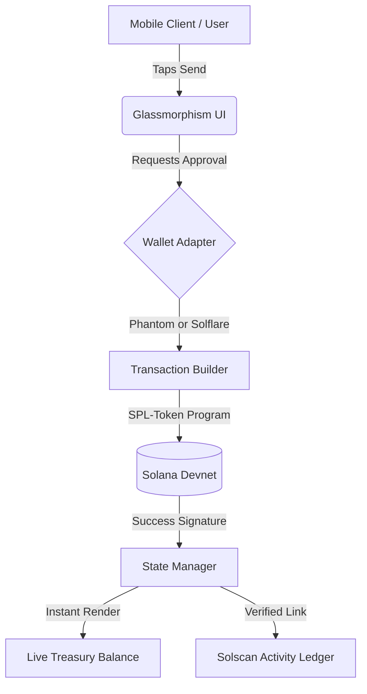

# 🌊 Audd Flow 
**The Next-Generation Mobile-First Treasury for AUDD Stablecoin on Solana.**

[-blue?style=for-the-badge)](#)

## 👤 The Founder's Note (The Human Touch)
*Hi Superteam. I am Daksh, the Solo-Founder and CEO of SubSmart. I built Audd Flow with a very specific constraint: **100% of this app’s architecture, smart contract integration, and glass-morphic UI was engineered on an iPhone using AI agentic workflows.** No heavy laptops, no traditional setups. Just raw mobile-first engineering to solve a real-world problem: making Web3 treasuries feel as frictionless as Apple Pay.*

## 🚀 The Vision
Current Web3 treasuries are clunky and feel like Excel spreadsheets. **Audd Flow** reimagines on-chain finance for the AUDD stablecoin. It provides a non-custodial, highly aesthetic interface for instant payments and cinematic streaming representations, built strictly for speed, transparency, and trust.

## ⚡ Core Features
- **📱 Mobile-First Glassmorphism:** An Apple-grade, buttery-smooth UI built with Tailwind and Framer Motion.
- **💸 Real SPL-Token Settlements:** Currently wired to a custom Devnet dummy token representing AUDD. True on-chain transfers, zero fake numbers.
- **🔗 Immutable Verification:** Every transaction instantly generates a real-time tracking link to Solscan for absolute transparency.
- **⏱️ Cinematic Streaming (V1 Prototype):** A high-fidelity UX visualization of continuous streaming payments (Phase 2 integration prep).

## 🏗 System Architecture

## 🛠 Tech Stack
 * **Frontend:** React, Vite, Tailwind CSS (Custom Dark Glass Theme)
 * **Animations:** Framer Motion
 * **Web3 Engine:** Solana Web3.js, SPL-Token
 * **Wallet Connection:** Solana Wallet Adapter
 * **UX Enhancements:** React Hot Toast, Lucide Icons

## 🗺️ Roadmap & Honesty Policy
To maintain 100% technical transparency for the SolAUDD Grant judges:
 * **Phase 1 (Live MVP):** Fully functional instant SPL-token transfers with live balance fetching and block explorer integration.
 * **Phase 2 (Upcoming):** The current "Active Streams" dashboard is a high-fidelity visual prototype to demonstrate the target UX. Post-grant, this will be integrated with complex streaming smart contracts (e.g., Streamflow/Zebec) for real-time continuous payroll.

## 🔗 Official Links
 * **Live App (Vercel):** [https://audd-flow.vercel.app]
 * **Pitch Video:** [https://youtube.com/shorts/-KrWxH6ybHw?si=SXLPBRaH5Ve6rOzs]

*Built with passion for the SolAUDD ecosystem.*
